# 🏗️ RAG Codebase Search - Architecture

## System Architecture Overview

```mermaid
graph TB
    subgraph Input["📥 Input Layer"]
        A1[Repomix Files]
        A2[.md Markdown]
        A3[.json JSON]
        A4[.txt Text]
    end

    subgraph Processing["🔄 Processing Layer"]
        B1[Document Loaders]
        B2[LangChain Text Splitter]
        B3[Chunk Size: 1000<br/>Overlap: 100]
    end

    subgraph Embeddings["🧮 Embedding Layer"]
        C1{Embedding Type}
        C2[Local Embeddings<br/>SentenceTransformers<br/>all-MiniLM-L6-v2]
        C3[OpenAI Embeddings<br/>text-embedding-ada-002]
    end

    subgraph Storage["💾 Vector Storage"]
        D1[FAISS Vector Store]
        D2[Similarity Search<br/>Top K=3]
    end

    subgraph LLM["🤖 LLM Layer"]
        E1{LLM Provider}
        E2[GLM Z.AI<br/>glm-4.5-air<br/>Max: 32K tokens]
        E3[Ollama Local<br/>qwen2.5-coder:7b<br/>Max: 8K tokens]
        E4[OpenAI<br/>gpt-3.5-turbo]
    end

    subgraph RAG["🔗 RAG Chain"]
        F1[RetrievalQA Chain]
        F2[Context Builder]
        F3[Prompt Template]
    end

    subgraph Web["🌐 Web Interface"]
        G1[Flask Backend<br/>Python]
        G2[HTML/CSS/JS<br/>Frontend]
        G3[Chat Interface]
        G4[File Upload]
    end

    subgraph Output["📤 Output"]
        H1[AI-Powered Answers]
        H2[Source References]
        H3[Conversation History]
    end

    A1 --> B1
    A2 --> B1
    A3 --> B1
    A4 --> B1
    
    B1 --> B2
    B2 --> B3
    B3 --> C1
    
    C1 -->|Local Mode| C2
    C1 -->|Cloud Mode| C3
    
    C2 --> D1
    C3 --> D1
    
    D1 --> D2
    D2 --> F1
    
    E1 -->|Priority 1| E2
    E1 -->|Priority 2| E3
    E1 -->|Fallback| E4
    
    E2 --> F1
    E3 --> F1
    E4 --> F1
    
    F1 --> F2
    F2 --> F3
    F3 --> G1
    
    G1 --> G2
    G2 --> G3
    G2 --> G4
    
    G3 --> H1
    H1 --> H2
    H2 --> H3

    style Input fill:#e1f5ff
    style Processing fill:#fff4e1
    style Embeddings fill:#f0e1ff
    style Storage fill:#e1ffe1
    style LLM fill:#ffe1e1
    style RAG fill:#ffe1f5
    style Web fill:#e1fff4
    style Output fill:#f5ffe1
```



## Technology Stack


## Data Flow Sequence

```mermaid
sequenceDiagram
    participant User
    participant Flask
    participant Loader
    participant Splitter
    participant Embeddings
    participant FAISS
    participant LLM
    participant RAG

    User->>Flask: Upload Repomix File
    Flask->>Loader: Load Document
    Loader->>Splitter: Split into Chunks
    Splitter->>Embeddings: Generate Embeddings
    Embeddings->>FAISS: Store Vectors
    FAISS-->>Flask: ✅ Ready
    Flask-->>User: Upload Success

    User->>Flask: Ask Question
    Flask->>FAISS: Search Similar Chunks
    FAISS-->>RAG: Return Top 3 Chunks
    RAG->>LLM: Generate Answer with Context
    LLM-->>RAG: AI Response
    RAG-->>Flask: Final Answer
    Flask-->>User: Display Answer
```



## Deployment Modes

```mermaid
graph TB
    subgraph Mode1["🏠 Fully Local Mode"]
        M1A[Ollama LLM<br/>Local Machine]
        M1B[Local Embeddings<br/>SentenceTransformers]
        M1C[FAISS<br/>Local Storage]
        M1D[✅ Zero API Costs<br/>✅ Complete Privacy<br/>✅ Offline Capable]
    end

    subgraph Mode2["🔀 Hybrid Mode"]
        M2A[GLM/OpenAI LLM<br/>Cloud API]
        M2B[Local Embeddings<br/>SentenceTransformers]
        M2C[FAISS<br/>Local Storage]
        M2D[✅ Better Accuracy<br/>✅ Lower Embedding Cost<br/>⚠️ API Required for LLM]
    end

    subgraph Mode3["☁️ Cloud Mode"]
        M3A[OpenAI LLM<br/>Cloud API]
        M3B[OpenAI Embeddings<br/>Cloud API]
        M3C[FAISS<br/>Local Storage]
        M3D[✅ Best Accuracy<br/>✅ Easy Setup<br/>⚠️ API Costs]
    end

    style Mode1 fill:#90ee90
    style Mode2 fill:#ffeb99
    style Mode3 fill:#87ceeb
```



## Configuration Flow

```mermaid
flowchart TD
    Start([Start Application]) --> CheckGLM{GLM API<br/>Configured?}
    
    CheckGLM -->|Yes| UseGLM[🤖 Use GLM LLM<br/>Z.AI API]
    CheckGLM -->|No| CheckOllama{Ollama<br/>Available?}
    
    CheckOllama -->|Yes| UseOllama[🏠 Use Ollama<br/>Local LLM]
    CheckOllama -->|No| CheckOpenAI{OpenAI API<br/>Configured?}
    
    CheckOpenAI -->|Yes| UseOpenAI[☁️ Use OpenAI<br/>Cloud LLM]
    CheckOpenAI -->|No| Error[❌ Error<br/>No LLM Available]
    
    UseGLM --> CheckEmbed{Local<br/>Embeddings?}
    UseOllama --> CheckEmbed
    UseOpenAI --> CheckEmbed
    
    CheckEmbed -->|Yes| LocalEmbed[🔧 Local Embeddings<br/>SentenceTransformers]
    CheckEmbed -->|No| CloudEmbed[☁️ OpenAI Embeddings]
    
    LocalEmbed --> Ready[✅ System Ready]
    CloudEmbed --> Ready
    Error --> Exit([Exit])
    Ready --> RunApp[🚀 Run Flask App<br/>Port 5555]
    
    style UseGLM fill:#ff6b6b
    style UseOllama fill:#90ee90
    style UseOpenAI fill:#87ceeb
    style LocalEmbed fill:#ffd93d
    style CloudEmbed fill:#c8b6ff
    style Ready fill:#50c878
    style Error fill:#ff4444
```



## Component Details

### 📥 Input Processing
- **Supported Formats**: `.txt`, `.md`, `.json`
- **Max File Size**: 16 MB
- **Loaders**: 
  - `UnstructuredMarkdownLoader` for Markdown
  - `TextLoader` for plain text
  - Custom JSON parser for Repomix format

### 🔄 Text Chunking
- **Chunk Size**: 1000 characters
- **Overlap**: 100 characters
- **Splitter**: `CharacterTextSplitter` from LangChain

### 🧮 Embeddings
**Local Option:**
- Model: `all-MiniLM-L6-v2`
- Dimension: 384
- Speed: ~500 tokens/sec

**Cloud Option:**
- Model: `text-embedding-ada-002`
- Dimension: 1536
- Speed: API dependent

### 💾 Vector Store
- **Engine**: FAISS (Facebook AI Similarity Search)
- **Search Type**: Similarity search
- **Top K Results**: 3
- **Storage**: In-memory

### 🤖 LLM Options

**GLM (Z.AI):**
- Model: `glm-4.5-air`
- Max Tokens: 32,768
- Temperature: 0.7
- Features: Thinking mode enabled

**Ollama:**
- Model: `qwen2.5-coder:7b`
- Max Tokens: 8,000
- Temperature: 0.7
- Features: Fully local

**OpenAI:**
- Model: Configurable
- Temperature: 0.7
- Features: Fallback option

### 🔗 RAG Chain
- **Type**: RetrievalQA
- **Chain Type**: "stuff" (combines all docs)
- **Features**: Source document tracking

## Performance Characteristics

```mermaid
graph LR
    subgraph Metrics["📊 Performance Metrics"]
        P1[Document Loading<br/>~1-2 sec]
        P2[Embedding Generation<br/>~2-5 sec]
        P3[Vector Search<br/>~0.1 sec]
        P4[LLM Response<br/>~3-15 sec]
        P5[Total Query Time<br/>~5-20 sec]
    end

    style Metrics fill:#e1f5ff
```



## Security Features

```mermaid
mindmap
    root((🔒 Security))
        File Upload
            Size Limit 16MB
            Extension Whitelist
            Secure Filename
        API Keys
            Environment Variables
            .env File Support
            No Hardcoding
        Data Privacy
            Local Processing Option
            No Data Logging
            Session Isolation
        Input Validation
            Query Sanitization
            File Type Checking
            Error Handling
```



---

## Quick Start

### 1. Install Dependencies
```bash
pip install -r requirements.txt
```

### 2. Configure LLM (Choose one)

**Option A: Fully Local (Ollama)**
```bash
# Install Ollama
curl -fsSL https://ollama.ai/install.sh | sh

# Pull model
ollama pull qwen2.5-coder:7b

# Start Ollama
ollama serve
```

**Option B: GLM (Z.AI)**
```bash
export USE_GLM=true
export GLM_API_KEY='your-api-key'
```

**Option C: OpenAI**
```bash
export OPENAI_API_KEY='sk-your-key'
```

### 3. Run Application
```bash
python app.py
```

Open browser: `http://localhost:5555`

---

## Environment Variables

| Variable | Default | Description |
|----------|---------|-------------|
| `USE_OLLAMA` | `true` | Enable Ollama LLM |
| `OLLAMA_MODEL` | `qwen2.5-coder:7b` | Ollama model name |
| `OLLAMA_BASE_URL` | `http://localhost:11434` | Ollama server URL |
| `OLLAMA_NUM_PREDICT` | `8000` | Max tokens for Ollama |
| `USE_GLM` | `false` | Enable GLM LLM |
| `GLM_API_KEY` | - | GLM API key |
| `GLM_MODEL` | `glm-4.5-air` | GLM model name |
| `GLM_MAX_TOKENS` | `32768` | Max tokens for GLM |
| `GLM_TEMPERATURE` | `0.7` | Temperature for GLM |
| `USE_LOCAL_EMBEDDINGS` | `true` | Use local embeddings |
| `EMBEDDING_MODEL` | `all-MiniLM-L6-v2` | Embedding model name |
| `OPENAI_API_KEY` | - | OpenAI API key (fallback) |

---

## Architecture Highlights

✅ **Modular Design**: Easy to swap LLMs, embeddings, and vector stores  
✅ **Flexible Configuration**: Support for local and cloud deployments  
✅ **Cost Efficient**: Fully local mode with zero API costs  
✅ **Privacy First**: All processing can be done locally  
✅ **Production Ready**: Error handling, validation, and logging  
✅ **Extensible**: Easy to add new document types and LLM providers  

---

**Built with ❤️ using Python, LangChain, FAISS, and modern web technologies**

